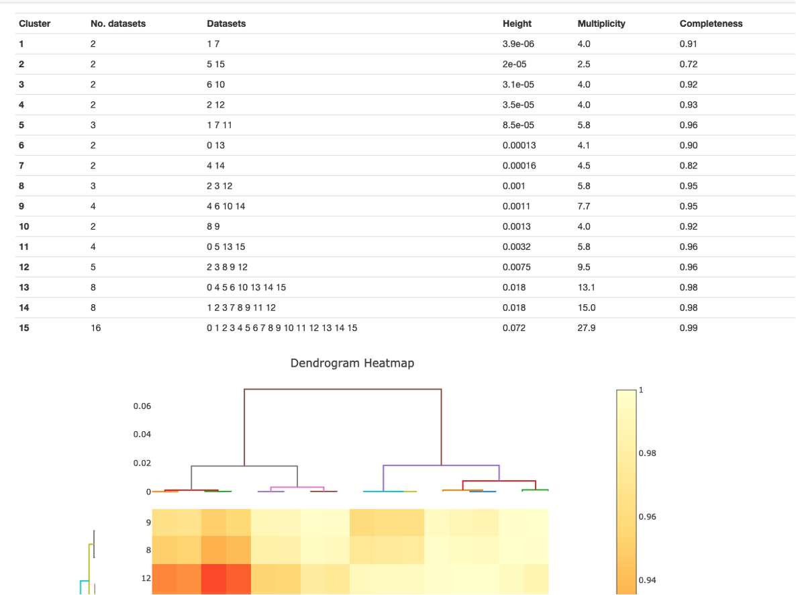

++++++++++++++++++++++++++++++++++++++++++++++++
Multi-crystal data reduction with xia2.multiplex
++++++++++++++++++++++++++++++++++++++++++++++++

xia2.multiplex is a DIALS-based data reduction pipeline for combining integrated data from hundreds of
small-wedge rotation datasets. The input to the pipeline is DIALS integrated datafiles
(i.e. ``integrated.expt`` and ``integrated.refl`` files). As of DIALS version 3.25, XDS integrated data can also
be processed if each ``INTEGRATE.HKL`` file is converted using ``dials.import_xds``.

xia2.multiplex performs the following routine: unit cell filtering, laue group analysis, unit cell
refinement, scaling, resolution analysis, space group analysis and merging. Additional non-isomorphism analysis is peformed and
dataset statistics and clustering are presented in the ``xia2.multiplex.html`` report.
For full details, see the publication at https://doi.org/10.1107/S2059798322004399 .

Although xia2.multiplex will automatically determine the resolution and space group, these can be manually overridden by setting the options
``resolution.d_min`` and ``symmetry.space_group``.

One feature of xia2.multiplex is the ability to optionally trigger further processing of subsets of the data. 
This guide provides an updated description of the different clustering options, which have been updated to use more intuitively named
options in xia2/DIALS versions greater than 3.22, as well as incorporating some additional features developed since this initial publication.

---------------------------------------
Scaling and merging of dataset clusters
---------------------------------------
*To trigger further scaling and merging of clusters, set the xia2.multiplex option*
``output_clusters=True``.
Note that the clustering options described here can also be run standalone with the ``xia2.cluster_analysis`` program, using the xia2.multiplex scaled
data files (``scaled.expt``, ``scaled.refl``) as input, but each cluster will not be further scaled and merged.

Dataset clustering can be performed based on a hierarchical dendrogram analysis (``clustering.method=hierarchical``)
or on density-based analysis of the cosym coordinates (``clustering.method=coordinate``). See the publication at https://doi.org/10.1107/S2059798325004589 for
more details of the density-based analysis.

Hierarchical clustering can be performed on one of two metrics; correlation coefficient clustering, based on pairwise
correlations between datasets, and 'cos-angle' clustering, based on angular separation of datasets
in the cosym coordinate space.
The hierarchical clustering method is controlled by the parameter ``hierarchical.method``, which can be set to ``cos_angle``, ``correlation`` or ``cos_angle+correlation``.
For the method(s) chosen, a number of clusters up to ``max_output_clusters`` (default value 10) will be scaled and merged, if they meet the following criteria which are controlled via the program parameters:

1. They have at least a completeness of ``min_completeness`` (default value 0).
2. They have at least a multiplicity of ``min_multiplicity`` (default value 0).
3. The number of datasets in the cluster is at least ``min_cluster_size`` (default value 5)
4. The maximum height of the cluster (height being the value of the dendrogram height as shown in the xia2.multiplex clustering output) is below ``max_cluster_height`` (default value 100).

If the clustering method is set to ``cos_angle+correlation``, then the max height for the two clustering methods are controlled individually with the parameters ``max_cluster_height_cc`` and ``max_cluster_height_cos``.

The default ``max_cluster_height`` values are large, such that the output clusters will typically be the `n=` ``max_output_clusters`` largest clusters. The dendrogram height values will be dataset specific, to choose
a particular value one can look at the **Intensity Clustering** section of a ``xia2.multiplex.html`` report:

As shown in this image, the height of a cluster is the point at which it separates into two smaller clusters in the dendrogram. So in this
example, the largest cluster splits at a height of 0.072, and these two clusters each split again around a height of 0.018.
So if clustering was run with ``max_output_clusters=2``, one would get the two largest clusters (clusters 13 and 14 here). But if the ``max_cluster_height`` were set to a value just below 0.018, one would obtain
the two smaller clusters with heights 0.0075 and 0.0032 (clusters 12 and 11).

After the clusters have been selected, each cluster is then individually scaled and merged.

-------------------------
Distinct cluster analysis
-------------------------
The analysis described above does not guarantee that clusters will not share some individual datasets; this is not necessarily a problem, a typical use case for xia2.multiplex is generating a number
of similar clusters containing similar datasets, to compare the effects of removing a number of outlier datasets on the overall statistics.
An alternative use case is where one is interested in distinct clusters of datasets, i.e. clusters that do not share any individual datasets, which may correspond to distinct crystal strutures
(this is the kind of clustering structure demonstrated in the image above). While this can be handled using the options above for small or simple cases, for large datasets the dendrogram structure
becomes very complex, with many dendrogram subtructures and branches. As such, the options above do not guarantee selection and evaluation of distinct clusters in a timely manner.

To generate output containing distinct clusters `instead` of the output above, one can use the option ``hierarchical.distinct_clusters=True``.
In this case, individual clusters must still meet the four criteria above, then an analysis is performed to determine distinct clusters that do not share any individual datasets.
These clusters are then individually scaled and merged.

---------------------
Coordinate clustering
---------------------
Density based clustering algorithms are a separate class of clustering algorithms compared to hierarchical clustering algorithms.
In xia2.multiplex, density-based clustering can be performed on the cosym coordinates, which reflect the systematic and random
non-isomorphism within the data. 
If ``clustering.method=coordinate``, the OPTICS clustering algorithm from scikit-learn is used to determine density-based clusters
(these clusters will always be distinct and not share any individual datasets).
Clusters that meet the ``min_multiplicity``, ``min_completeness`` and ``min_cluster_size`` thresholds will be individually scaled and merged.

------------------------------------------
Allowed tolerance for unit cell parameters
------------------------------------------
The tolerance for accepted unit cell parameters in xia2.multiplex is set to be reasonably strict. The default value for ``symmetry.cosym.relative_length_tolerance`` is 0.05, which means that any datasets with unit
cell lengths outside of this relative tolerance range will be rejected. For unit cell angles, the default value for ``symmetry.cosym.absolute_angle_tolerance`` is 2, meaning all unit cell angles that fall outside
of this absolute tolerance range will also be rejected. These ranges are evaluated based on the best median unit cell established through dials.cosym (run within xia2.multiplex). 

These tolerance values have been found effective where the goal of the multi-crystal data collection is a single, high quality dataset. In the case where multiple distinct crystal structures may be present, these
tolerance values can be increased to permit more data through into the clustering analysis. For instance, one recommended option to look for other distinct states without permitting data through that are too different
is to set ``symmetry.cosym.relative_length_tolerance=0.1``.

---------------------
Scaling and filtering
---------------------
An alternative means of filtering data within xia2.multiplex is to use :math:`{\Delta}CC1/2` filtering, as described in the publication.
This is separate to any cos-angle or correlation clustering analysis and is also optional, not being run by default. 
To trigger this, use the option ``filtering.method=deltacchalf``. In this method, the :math:`{\Delta}CC1/2` is calculated for a group of images: groups with a :math:`{\Delta}CC1/2`
below ``deltacchalf.stdcutoff`` are removed (standard deviations below the mean, default value 4.0). A group is either a group of images or an individual dataset, the choice is made
with the parameter ``deltacchalf.mode=dataset`` or ``deltacchalf.mode=image_group`` (dataset is the default). If using the ``image_group`` mode, one must choose the number of images in each group with
the ``deltacchalf.group_size`` parameter (default value 10).
The filtering starts on the combined scaled dataset, and several cycles of repeated scaling and filtering are performed. This stops when one of the following criteria are met:

1. The number of cycles reaches ``deltacchalf.max_cycles`` (default 6).
2. The percentage of reflections removed exceeds ``deltacchalf.max_percent_removed`` (default 10).
3. The completess drops below ``deltacchalf.min_completeness`` (default 0).
4. No groups are removed in the latest cycle of filtering.

A merging statistics report for filtered dataset will be generated and displayed in the **Filtered** tab in the ``xia2.multiplex.html`` report.
Plots of changes in statistics during the scaling and filtering cycles can be found in the **Scaling and filtering plots** section in the **Summary** tab.

**Key points:**

- Turn on cycles of :math:`{\Delta}CC1/2` filtering + scaling with the option ``filtering.method=deltacchalf``.
- The ``deltacchalf.stdcutoff`` parameter is the main way to control the amount of data that is filtered out. Setting this to a lower number means that more data is filtered at each step.
- In the case of radiation damage towards the end of sweeps, it may be better to just exclude the end of sweeps rather than full sweeps; this is an ideal use case for the ``deltacchalf.mode=image_group`` option.
