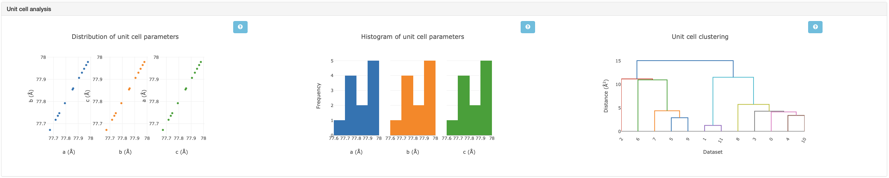
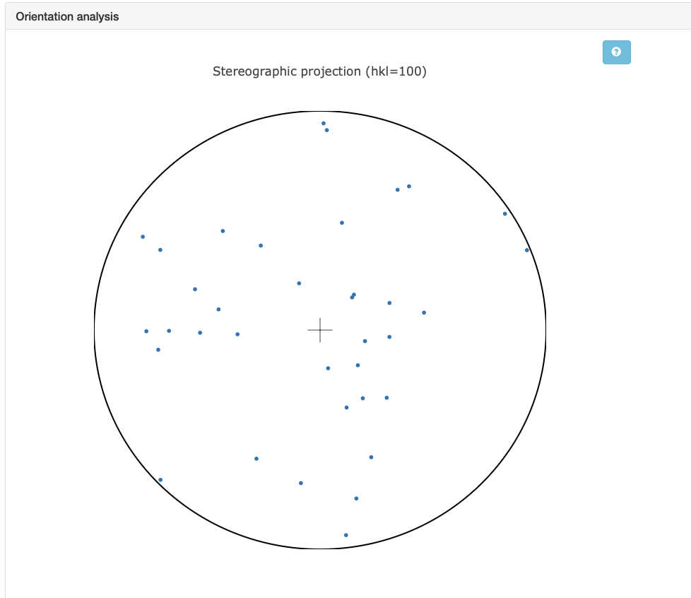
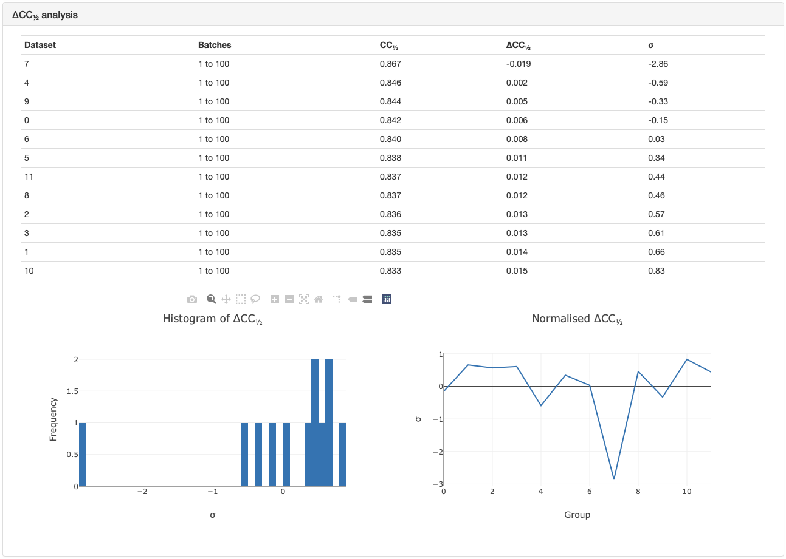

+++++++++++++++++++++++++++++
Basic Usage of xia2.multiplex
+++++++++++++++++++++++++++++
-------------
Tutorial Data
-------------
The data (~6GB total) were collected on I24 at Diamond Light Source and is available to download from |cows_pigs_people_data|.
36 insulin crystals were collected from a range of 🐮, 🐷, and 💁‍♀️, with small rotation wedges recorded on each.
All data have symmetry I 2\ :sub:`1` 3. For this introduction to multiplex, we will only be using the data from the
🐮 insulin (~2GB). For a more advanced tutorial in automatically handling multi-crystal data with multiple "things" present,
see `this tutorial`_.

Once you have the data downloaded, this script (linux / UNIX) can help extract the data faster.

::

    mkdir data
    cd data
    for set in CIX1_1 CIX2_1 CIX3_1 CIX5_1 CIX6_1 CIX8_1 CIX9_1 CIX10_1 CIX11_1 CIX12_1 CIX14_1 CIX15_1 ; do
    wget https://zenodo.org/records/13890874/files/${set}.tar
    tar xvf ${set}.tar
    rm -v ${set}.tar
    done

.. |cows_pigs_people_data|   image::  https://zenodo.org/badge/DOI/10.5281/zenodo.13890874.svg
                             :target: https://doi.org/10.5281/zenodo.13890874

--------------
DIALS Workflow
--------------
``xia2.multiplex`` is a tool to scale and merge multi-crystal data: therefore, it requires integrated files to start with.
To get our integrated files from our raw images, we can use a standard DIALS workflow. Note that data from multiple crystals
will not in general share an orientation matrix, so the indexing should not join all the lattices.

This tutorial assumes knowledge of processing with DIALS. For more information, see this `DIALS tutorial`_.

::

    dials.import data/*gz
    dials.find_spots imported.expt
    dials.index imported.expt strong.refl joint=False
    dials.refine indexed.expt indexed.refl
    dials.integrate refined.expt refined.refl

--------------
xia2.multiplex
--------------
``xia2.multiplex`` can now be run on this data. First, the software will do some preliminary unit cell clustering to
remove any datasets with a very different unit cell. Next, consistent symmetry will be applied and any indexing ambiguities are
resolved. Note that this uses ``dials.cosym`` under the hood. Next, the data is scaled, and the space group is determined.
Once the data is merged, a range of analyses are performed which are useful for diagnostics. Let's explore this on the example data.

::

    xia2.multiplex integrated.expt integrated.refl

Note that if you have separate integrated files you can list them in the input command.

::

    xia2.multiplex integrated_1.expt integrated_1.refl integrated_2.expt integrated_2.refl

There are also some additional command-line options you may find useful:
 * ``symmetry.space_group`` - set the space group if known, which can speed up symmetry analysis. 
 * ``resolution.d_min`` - set the resolution cut-off, otherwise it will be automatically determined.
 * ``filtering.method`` - applies additional filtering, see :doc:`here <multiplex_filtering>`.
 * ``clustering.output_clusters`` - output identified sub-clusters, see :doc:`here <intensity_based_clustering>` for more choices and details.

.. important::

    For newer versions of DIALS (main branch and > 3.29) you will find the output organised into various folders.

    In the parent folder where ``xia2.multiplex`` was run, you can find the primary logs and reports from the multi-crystal analysis.
    You can also find citation information and ``xia2-multiplex-working.phil``. This
    contains the configuration of all commandline parameters used by ``xia2.multiplex``.

    **DataFiles**:
    This folder contains the final files you will find useful for feeding into structure solution/refinement pipelines. This includes any
    clusters that have been output as well as filtered data if this option is selected.

    **LogFiles**:
    This folder contains the log files and graphical reports from intermediate processing steps.

    **Processing**:
    This folder contains the key ``.expt / .refl`` files and ``.json`` logs. For files of these types output
    by intermediate steps of the multiplex pipeline, you can set the commandline option
    ``cleanup=False`` and additional files will be output to this folder.

----------------------------------
Diagnostic Tools in xia2.multiplex
----------------------------------

Most diagnostic graphs are available in ``xia2.multiplex.html``. Some extra plots are output as ``.png`` files to the working folder.

**Unit cell analysis:**
The unit cell of each crystal input to ``xia2.multiplex`` is plotted to give an initial analysis of isomorphism. To see the
unit cell distributions of all input data, open `cluster_unit_cell_p1`. If you see subgroups in the dendrogram denoted by
different colours, this means there are some major differences in unit cell and only the largest will be considered for analysis 
with xia2.multiplex. If the entire dendrogram is the same colour, then all datasets will be fed into the pipeline. The ``xia2.multiplex.html``
log file also contains graphs related to unit cell clustering. It is important to note that these graphs only pertain to any subset 
chosen by the initial unit cell filtering. Subtle differences in unit cell can still occur, and the initial unit cell filtering
is fairly conservative, so these graphs are worth examining. In this case, all the data were accepted during the initial filtering,
and are shown to have very similar unit cells.

**Orientation analysis:**
Multi-crystal data collections often have small wedges either due to radiation damage constraints, or sample environment
constraints (i.e. *in situ* data collections). A risk with such experiments are that all the crystals are measured in the same
orientation, and the same small volumes of reciprocal space are measured repeatedly. Coverage of reciprocal space can be
assessed by considering the distributions of the unit cell axes in reciprocal space. A stereographic projection plot is used
for this. If the dots are widely distributed around the circles, then there is wide coverage of reciprocal space and
preferential orientation is not an issue.

:math:`{\Delta}CC1/2`:
Another useful tool is the :math:`{\Delta}CC1/2` analysis. This shows whether individual datasets contribute positively,
or negatively to the overall quality of the merged dataset. Note that any outliers are not removed unless ``filtering.method=deltacchalf``
is used. In this case, the :math:`{\Delta}CC1/2` for each dataset is quite minimal, although one dataset has a stronger effect
than the others and could be removed if desired. The *intensity clustering* can also be compared to help determine if outliers here are significant.

**Intensity clustering:**
An analysis that compares the intensities of each dataset to see if there are any differences. This is useful to identify if there are
subsets within the data that should be grouped together and merged separately. See `this tutorial`_ for more information on interpreting
the graphs within this section. 

.. _this tutorial: https://dials.github.io/documentation/tutorials/intensity_based_clustering.html
.. _DIALS tutorial: https://dials.github.io/documentation/tutorials/processing_in_detail_betalactamase.html
