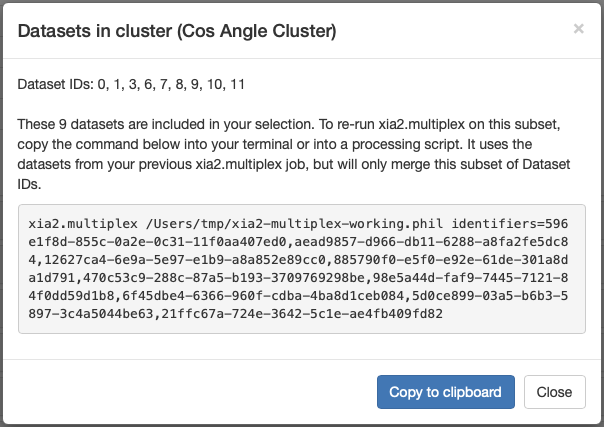
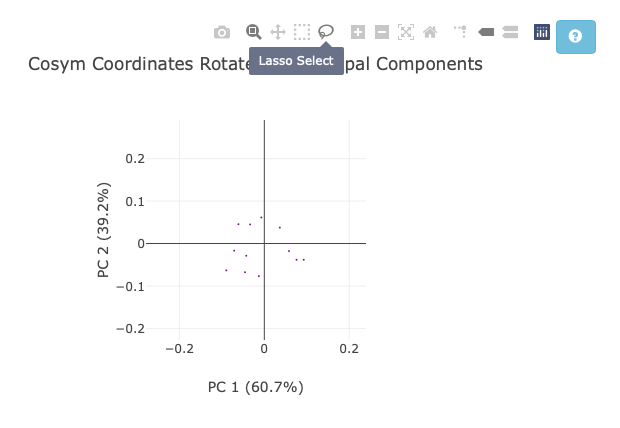
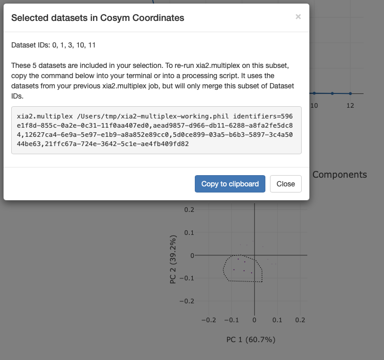
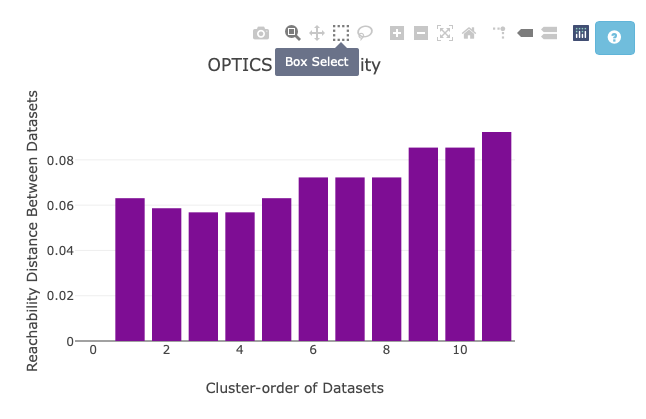
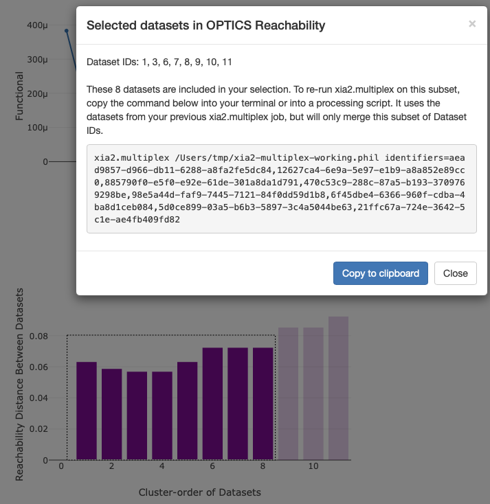
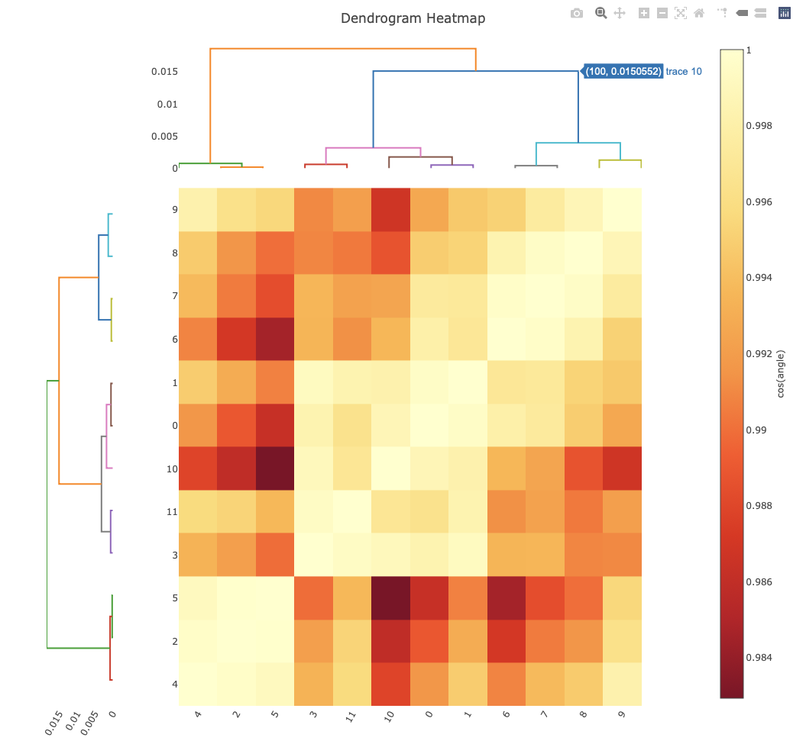

++++++++++++++++++++++++++
Custom Clustering via HTML
++++++++++++++++++++++++++

.. important::

    The features described on this page require DIALS >= 3.28.0. They are not available in earlier versions of DIALS.

``xia2.multiplex`` outputs a html file summarising the outcome of the multi-crystal analysis (``xia2.multiplex.html``).
In ``xia2.multiplex.html``, a range of intensity-based clustering graphs are produced. For help interpreting these plots,
see this `clustering tutorial`_. For coordinate clustering, it is possible that you may want a cluster scale and merged that
is not automatically identified. For hierarchical clustering, it is :doc:`possible<intensity_based_clustering>`, but fiddly
to set the commandline parameters to output the cluster you want. It is now possible to select clusters from ``xia2.multiplex.html``
to simplify this process.

--------
Overview
--------
By interacting with the intensity-based clustering graphs as described below, a pop-up box will appear in your web browser.
This will provide a multiplex input command. To scale and merge the cluster you selected, all you need to do is paste this
command into your terminal and run it. This will run a multiplex job to scale and merge this subset of data only.
This command specifies the sub-set of datasets from your selection, and uses the 
``xia2-multiplex-working.phil`` file to configure multiplex in the same way as the original job. This means you do not need
to specify the input files again, as they are imported from ``xia2-multiplex-working.phil``. Note that this will not provide
side-by-side comparison of data quality statisitics as you would get if you :doc:`selected clusters via the commandline<intensity_based_clustering>`.

---------------------
Coordinate Clustering
---------------------
For the coordinate-based clustering method, you have two ways of selecting a custom cluster of data.

1. The **Cosym Coordinates Rotated by Principal Components** plot

2. The **OPTICS Reachability** plot

For the coordinate plot, first zoom in the graph as needed, then click the lasso selection tool.
Next, draw around the data you would like scaled and merged together. This will trigger the multiplex command pop up.

For the reachability plot, you can also use the lasso tool, but may find the box selection tool easier.
Once again, draw around the datasets you would like scaled and merged.

-----------------------
Hierarchical Clustering
-----------------------
For both the correlation and cosine angle clustering, simply click on the branch of the dendrogram
you would like to output. Make sure the trace label that pops up is the same colour as the branch you
have the cursor hovered over. Note that *all datasets* under the selected branch will be selected.
In this example, all datasets except 4, 2, and 5 have been selected. 

.. _clustering tutorial: https://dials.github.io/ADD_FULL_LINK